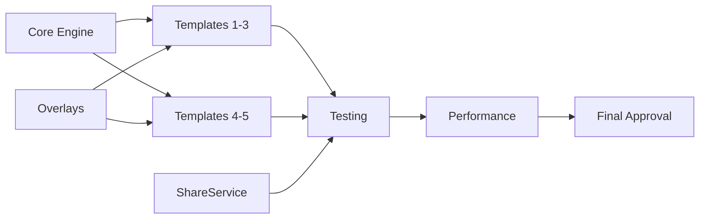

# TikTok Viral Content - Agent Task Assignments
*Project Start: January 12, 2025*

## 🎯 Agent 1: Project Manager (PM)

### Immediate Tasks (Hour 0-1)
1. ✅ Create project documentation structure
2. ✅ Define agent roles and responsibilities  
3. ✅ Establish communication protocols
4. ⏳ Monitor all agent startup
5. ⏳ Create progress tracking dashboard

### Ongoing Tasks
- Monitor progress every 2 hours
- Resolve blocking issues within 30 minutes
- Coordinate dependencies
- Ensure requirements compliance
- Daily status reports
- Risk assessment updates

### Deliverables
- Progress reports every 4 hours
- Blocking issue resolutions
- Integration coordination
- Final quality approval

---

## 🏗️ Agent 2: Core Engine Developer (CED)

### Phase 1 Tasks (Hours 0-8)
1. Create Recipe+Video extension with all required properties
2. Implement MediaBundle model with validation
3. Create RenderConfig with default values
4. Build ViralVideoEngine base class
5. Implement Planner protocol
6. Create RenderPlan data structure

### Phase 2 Tasks (Hours 8-16)
7. Implement Renderer with AVFoundation
8. Build AVMutableComposition pipeline
9. Create StillWriter for image→video
10. Implement CVPixelBuffer management
11. Add H.264/AAC export settings
12. Create temp file management

### Phase 3 Tasks (Hours 16-24)
13. Optimize memory usage
14. Add progress callbacks
15. Implement error handling
16. Create cleanup mechanisms
17. Performance profiling
18. Integration support

### Deliverables
```swift
// Core classes ready for use
class ViralVideoEngine
class Renderer
class StillWriter
struct RenderPlan
struct RenderConfig
```

---

## 🎨 Agent 3: Overlay & Animation Specialist (OAS)

### Phase 1 Tasks (Hours 0-8)
1. Create OverlayFactory base class
2. Implement textLayer with safe zone validation
3. Build roundedSticker with padding
4. Create heroHookOverlay (64pt, white, stroke)
5. Implement ctaOverlay with spring animation
6. Build ingredientCallout with drop animation

### Phase 2 Tasks (Hours 8-16)
7. Create splitWipeMaskOverlay with circular reveal
8. Implement ingredientCountersOverlay with stagger
9. Build kineticStepOverlay with slide animation
10. Create stickerStackOverlay with pop effect
11. Implement progressOverlay with gradient
12. Build pipFaceOverlay placeholder

### Phase 3 Tasks (Hours 16-24)
13. Create calloutsOverlay for ingredients
14. Implement safe zone checking system
15. Add RTL support for text
16. Create animation timing curves
17. Build shadow/stroke system
18. Optimize CALayer performance

### Deliverables
```swift
class OverlayFactory {
    static func textLayer(...) -> CATextLayer
    static func roundedSticker(...) -> CALayer
    // All overlay builders
}
```

---

## 📹 Agent 4: Template Developer 1 (TD1)

### Template 1: Beat-Synced Carousel (Hours 8-16)
1. Implement planBeatSynced method
2. Create blur effect for BEFORE hook
3. Build Ken Burns transform calculator
4. Implement snap sequence builder
5. Add beat detection hooks (stub)
6. Create timeline with proper durations

### Template 2: Split-Screen Swipe (Hours 16-24)
7. Implement planSplitSwipe method
8. Create circular wipe mask
9. Build counter animation sequence
10. Implement BEFORE/AFTER transition
11. Add ingredient counter layout
12. Create end card with CTA

### Template 3: Kinetic Steps (Hours 24-32)
13. Implement planKinetic method
14. Process recipe steps (5-7 words)
15. Create step animation sequence
16. Handle b-roll integration
17. Add background motion
18. Implement auto-captioning

### Deliverables
- Three working templates
- Proper timing for each
- Safe zone compliance
- Dynamic text integration

---

## 🎬 Agent 5: Template Developer 2 (TD2)

### Template 4: Price/Time Challenge (Hours 8-16)
1. Implement planPriceTime method
2. Create sticker stack layout
3. Build progress bar animation
4. Handle cost/time/calorie display
5. Implement b-roll fallback
6. Create challenge timing

### Template 5: Green Screen PIP (Hours 16-24)
7. Implement planGreenScreen method
8. Create PIP circle overlay
9. Build ingredient callouts
10. Handle face placeholder
11. Implement salvage highlights
12. Create "fridge to plate" flow

### Visual Effects (Hours 24-32)
13. Implement CIColorControls for color pop
14. Create CIGaussianBlur for blur effects
15. Build transform system for Ken Burns
16. Implement shadow rendering
17. Create vignette effects
18. Optimize filter performance

### Deliverables
- Two working templates
- Complete effects system
- Filter implementations
- Transform utilities

---

## 📱 Agent 6: ShareService & SDK Integrator (SSI)

### ShareService Implementation (Hours 0-8)
1. Create ShareError enum
2. Implement requestPhotoPermission
3. Build saveToPhotos with PHPhotoLibrary
4. Create fetchAssets helper
5. Implement shareToTikTok method
6. Add caption generation

### TikTok SDK Setup (Hours 8-16)
7. Configure Info.plist entries
8. Add URL scheme handlers
9. Implement AppDelegate methods
10. Create SceneDelegate handlers
11. Add sandbox credentials
12. Test URL scheme detection

### Integration & Error Handling (Hours 16-24)
13. Create end-to-end share flow
14. Implement permission denied handling
15. Add TikTok not installed flow
16. Create retry mechanisms
17. Build progress indicators
18. Add clipboard handling

### Deliverables
```swift
enum ShareService {
    static func saveToPhotos(...) -> Result<String, ShareError>
    static func shareToTikTok(...) -> Result<Void, ShareError>
}
```

---

## 🧪 Agent 7: Quality Assurance & Testing (QAT)

### Test Setup (Hours 0-8)
1. Create test Recipe models
2. Generate test MediaBundles
3. Build test harness
4. Create performance baselines
5. Set up device simulators
6. Prepare test matrices

### Component Testing (Hours 8-24)
7. Test each template individually
8. Verify safe zone compliance
9. Test overlay animations
10. Validate text rendering
11. Check memory usage
12. Measure render times

### Integration Testing (Hours 24-32)
13. End-to-end template tests
14. Share flow testing
15. Permission handling tests
16. Error recovery testing
17. Device compatibility tests
18. TikTok integration tests

### Final Validation (Hours 32-40)
19. Performance benchmarks
20. Memory leak detection
21. Frame rate validation
22. File size verification
23. Quality checklist completion
24. Bug report compilation

### Deliverables
- Test suite with 100+ tests
- Performance report
- Device compatibility matrix
- Bug list with priorities

---

## 📊 Agent 8: Performance & Polish (PAP)

### Performance Baseline (Hours 0-8)
1. Set up Instruments profiling
2. Create memory benchmarks
3. Measure render times
4. Profile CPU usage
5. Check disk I/O
6. Identify bottlenecks

### Optimization Sprint 1 (Hours 8-16)
7. Optimize CVPixelBuffer usage
8. Implement frame caching
9. Reduce memory allocations
10. Optimize CIContext reuse
11. Improve transform calculations
12. Cache overlay layers

### Optimization Sprint 2 (Hours 16-24)
13. Reduce file sizes
14. Optimize video encoding
15. Improve animation performance
16. Minimize concurrent operations
17. Optimize text rendering
18. Reduce temporary files

### Polish & Finishing (Hours 24-32)
19. Add progress indicators
20. Implement smooth transitions
21. Polish error messages
22. Add haptic feedback
23. Create loading states
24. Final performance validation

### Deliverables
- Performance optimized to <5s render
- Memory usage <150MB
- File sizes <20MB average
- 30fps constant playback
- Zero memory leaks

---

## Parallel Execution Plan

### Hour 0-8: Foundation
- **CED**: Core models and engine
- **OAS**: Basic overlays
- **SSI**: ShareService base
- **QAT**: Test setup
- **PAP**: Baselines
- **PM**: Coordination

### Hour 8-16: Core Implementation
- **CED**: Renderer complete
- **OAS**: All overlays ready
- **TD1**: Template 1 done
- **TD2**: Template 4 done
- **SSI**: SDK integrated
- **QAT**: Component tests
- **PAP**: First optimizations
- **PM**: Integration check

### Hour 16-24: Template Completion
- **CED**: Support & fixes
- **OAS**: Refinements
- **TD1**: Template 2 done
- **TD2**: Template 5 done
- **SSI**: Error handling
- **QAT**: Integration tests
- **PAP**: Deep optimization
- **PM**: Quality check

### Hour 24-32: Integration & Polish
- **All**: Bug fixes
- **TD1**: Template 3 done
- **TD2**: Effects complete
- **QAT**: Device testing
- **PAP**: Final optimizations
- **PM**: Feature freeze

### Hour 32-40: Final Testing
- **All**: Polish and fixes
- **QAT**: Complete validation
- **PAP**: Performance certification
- **PM**: Sign-off

---

## Critical Path Dependencies



## Success Metrics Per Agent

### CED Success
- ✅ Engine renders video
- ✅ Memory <150MB
- ✅ No crashes

### OAS Success
- ✅ All overlays render
- ✅ Animations smooth
- ✅ Safe zones respected

### TD1 Success
- ✅ 3 templates work
- ✅ Timing correct
- ✅ Dynamic text works

### TD2 Success
- ✅ 2 templates work
- ✅ Effects apply
- ✅ PIP placeholder ready

### SSI Success
- ✅ Videos save to Photos
- ✅ TikTok opens
- ✅ Caption in clipboard

### QAT Success
- ✅ All tests pass
- ✅ No critical bugs
- ✅ Performance validated

### PAP Success
- ✅ <5s render time
- ✅ <20MB file size
- ✅ 30fps playback

### PM Success
- ✅ All agents deliver
- ✅ Integration complete
- ✅ Quality approved

This detailed task list ensures all agents know exactly what to build and when to deliver it.